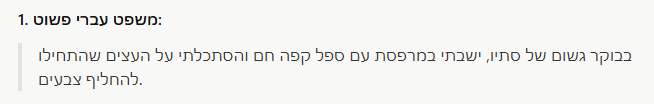
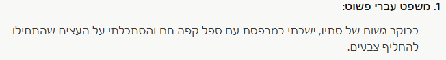
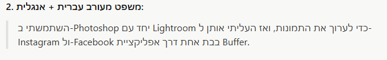
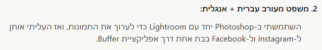
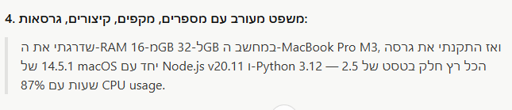
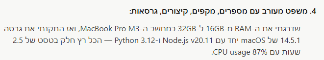
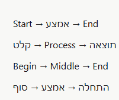
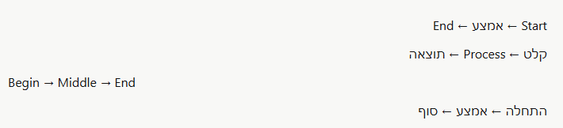

# RTL Adaptive 🔁

> A browser extension that intelligently applies Right-to-Left direction to any element on any website — without breaking anything else.

---

## 🌟 What is it?

**RTL Adaptive** lets you click on any block of text on any website and have it render properly in Hebrew (or any RTL context). It's a "pick and fix" tool — instead of trying to auto-detect everything, you choose exactly which parts of the page should flip.

Perfect for websites that don't natively support Hebrew well, or for chat interfaces (like LLM chats) where responses mix Hebrew and English.

### 🆚 How is it different from other RTL extensions?

- **💸 Free** — no subscriptions, no accounts, no upsells
- **🌐 Works on any website** — not limited to specific apps or platforms
- **🎯 Surgical, not invasive** — you pick only the blocks you want to flip, the rest of the page stays exactly as the site designed it

---

## ✨ Features

### 🎯 Smart adaptive direction

The extension doesn't blindly flip everything — it analyzes the content of each paragraph and element individually:

- **Hebrew paragraph** → RTL direction, right-aligned
- **Mixed Hebrew + English** → RTL container, but English words are wrapped as LTR islands so they stay readable
- **Pure English paragraph** (even inside a Hebrew block) → untouched, stays LTR
- **Numbers and punctuation only** (`00:10 - 00:30`) → left alone, no direction forced

### ↔️ Arrow handling

Arrows are flipped physically (`→` becomes `←`) **only in paragraphs that contain Hebrew**. Pure English sentences keep their arrows as-is.

| Input | Result |
|---|---|
| `Start ← אמצע ← End` | `End ← אמצע ← Start` (reads right-to-left) |
| `Begin → Middle → End` | `Begin → Middle → End` (unchanged) |
| `קלט ← Process ← תוצאה` | `תוצאה ← Process ← קלט` |

### 🚫 What the extension will NEVER touch

- **Input fields, textareas, and contenteditable areas** (chat boxes, rich text editors)
- Even when picking a large block that *contains* a chat input, the input stays untouched — the extension detects it and skips it
- This means features like bullet lists, numbered lists, and formatting toolbars in editors remain fully functional

### 🧠 Smart block management

- **Smaller block already covered?** — When you try to pick a block inside an already-saved larger block, the extension tells you and prevents duplicates
- **Larger block containing smaller ones?** — Picking a parent block automatically removes the smaller saved blocks it contains
- Per-domain storage — each website has its own block list

---

## 🎮 How to use

1. **Click the extension icon** in your browser toolbar → popup opens
2. **Click "Pick a block on this page"** → popup closes, hover mode activates
3. **Hover** elements on the page — they'll highlight with an orange outline
4. **Click** the element you want → RTL is applied instantly and the block is saved
5. **Press Esc** at any time to cancel picking

### Managing your blocks (from the popup)

- **✎ Edit icon** — rename any saved block to something memorable
- **Toggle switch** — turn RTL on/off for a specific block without deleting it
- **✕ Delete button** — remove the block permanently and revert the page
- **Export** — download your saved blocks as JSON (choose which domains)
- **Import** — load blocks from a JSON file

---

## 📸 Before & After

| Before                             | After                            |
|------------------------------------|----------------------------------|
|  |  |
|  |  |
|  |  |
|  |  |

---

## 📥 Download

Choose your browser:

- **[⬇️ Download for Chrome / Edge / Brave / Opera](https://github.com/Lidor-Mashiach/Adaptive-RTL-Extension/releases/download/v1.0.0/rtl-adaptive.zip)**
- **[⬇️ Download for Firefox](https://github.com/Lidor-Mashiach/Adaptive-RTL-Extension/releases/download/v1.0.0/rtl-adaptive-firefox.zip)**

> The Chrome version works on all Chromium-based browsers (Chrome, Edge, Brave, Opera, Vivaldi, Arc).

---

## 🔧 Installation (Chrome / Edge / Brave / Opera)

Since this extension isn't published to the Web Store, you'll install it manually as an "unpacked extension".

### Step 1 — Extract the ZIP to a permanent folder

**⚠️ Important:** Once you load the extension, the browser will reference this folder every time it starts. If you delete or move the folder, the extension will break.

- **Good location:** `C:\Users\YourName\browser-extensions\rtl-adaptive\`
- **Bad location:** Downloads folder (you might clean it out later)

Extract the ZIP contents into this permanent folder.

### Step 2 — Enable Developer Mode

1. Open your extensions page:
   - Chrome: `chrome://extensions`
   - Edge: `edge://extensions`
   - Brave: `brave://extensions`
   - Opera: `opera://extensions`
2. In the top-right corner, toggle **"Developer mode"** ON
   - If you've never developed extensions before, this toggle will be OFF — turn it on
   - A new row of buttons will appear: *Load unpacked*, *Pack extension*, *Update*

### Step 3 — Load the extension

1. Click **"Load unpacked"**
2. Select the folder where you extracted the ZIP
3. The extension appears in your extensions list and in the toolbar

### Updating to a new version

When a new version is released:
1. Download the new ZIP
2. Extract it to the **same folder**, overwriting the old files
3. Go to the extensions page and click the 🔄 refresh icon on the extension's card

---

## 🦊 Installation (Firefox)

Firefox requires extensions to be signed by Mozilla for permanent installation. Since this extension isn't signed, you have two options:

### Option 1 — Temporary install (easiest, resets when Firefox closes)

1. Open `about:debugging#/runtime/this-firefox`
2. Click **"Load Temporary Add-on..."**
3. Select the ZIP file (or the `manifest.json` inside the extracted folder)
4. The extension appears in the toolbar

> ⚠️ This installation is removed every time you close Firefox. You'll need to reload it each session.

### Option 2 — Permanent install (Firefox Developer Edition / Nightly only)

The regular Firefox blocks permanent installation of unsigned add-ons. Use **Firefox Developer Edition** or **Firefox Nightly** for this option.

1. Open `about:config`
2. Search for `xpinstall.signatures.required` and set it to `false`
3. Open `about:addons`
4. Click the gear icon ⚙️ → **"Install Add-on From File..."**
5. Select the ZIP file
6. The extension stays installed permanently

### Option 3 — Sign via Mozilla (works on any Firefox, permanent) ⭐

This is the recommended option if you want the extension to work on the **regular Firefox** and stay installed forever. You get the extension signed by Mozilla without publishing it to the public Add-ons store.

1. **Create a Mozilla account** (free) at [addons.mozilla.org](https://addons.mozilla.org/developers/)
2. Go to the [Developer Hub](https://addons.mozilla.org/developers/addon/submit/distribution) → **Submit a New Add-on**
3. Choose **"On your own"** (self-distribution / unlisted) — *not* "On this site"
   - This means the add-on won't appear in the public Mozilla Add-ons store, but it will be signed
4. Upload the ZIP file (`rtl-adaptive-firefox.zip`)
5. Wait for the automatic review (usually a few minutes, sometimes longer)
6. Once approved, you'll receive a **signed `.xpi` file** — this is what you install
7. Open `about:addons` → gear icon ⚙️ → **"Install Add-on From File..."** → select the signed `.xpi`

The signed extension now installs permanently on any Firefox (regular, Developer, Nightly, ESR) and survives browser restarts.

> ℹ️ **Why this works:** Mozilla's policy requires all permanent extensions to be signed. Self-distribution means you still host the file yourself (GitHub, your own site, etc.), but Mozilla handles the signing so users don't need special Firefox builds.

---

# הסבר בעברית 🇮🇱

## 🌟 מה זה?

**RTL Adaptive** הוא תוסף דפדפן שמאפשר לבחור כל אלמנט טקסט בכל אתר ולהחיל עליו כיוון RTL בצורה חכמה — בלי לשבור שום דבר אחר בדף.

במקום לנסות לזהות אוטומטית מה צריך להתהפך, **אתה בוחר ידנית** אילו בלוקים בדף ינוהלו ע"י התוסף.

מתאים במיוחד לאתרים שלא תומכים טוב בעברית, או לממשקי צ'אט של LLMs (כמו Claude, ChatGPT) שבהם התשובות מערבבות עברית ואנגלית.

### 🆚 במה התוסף שונה מאחרים?

- **💸 חינמי** — בלי מנויים, בלי הרשמה, בלי upsells
- **🌐 עובד בכל אתר** — לא מוגבל לאפליקציות או פלטפורמות ספציפיות
- **🎯 אדפטיבי, מותאם אישית** — אתה בוחר רק את הבלוקים שאתה רוצה להפוך, שאר הדף נשאר בדיוק כפי שהאתר עיצב אותו

---

## ✨ מאפיינים

### 🎯 כיוון אדפטיבי חכם

התוסף מנתח כל פסקה ואלמנט לחוד, לא הופך הכל באופן עיוור:

- **פסקה בעברית** ← כיוון RTL, יישור לימין
- **פסקה מעורבת עברית + אנגלית** ← כיוון RTL, אבל מילים באנגלית נעטפות כאטומים LTR כך שהן נשארות קריאות
- **פסקה באנגלית בלבד** (גם אם היא בתוך בלוק עברי) ← לא נוגעים, נשארת LTR
- **מספרים וסימני פיסוק בלבד** (למשל `00:10 - 00:30`) ← לא נוגעים, לא מאלצים כיוון

### ↔️ טיפול בחצים

חצים נהפכים פיסית (`→` הופך ל-`←`) **רק בפסקאות שמכילות עברית**. פסקאות באנגלית טהורה שומרות על החצים כפי שנכתבו.

| הקלט | התוצאה |
|---|---|
| `Start → אמצע → End` | `End → אמצע → Start` (קריאה מימין לשמאל) |
| `Begin → Middle → End` | `Begin → Middle → End` (לא משתנה) |
| `קלט → Process → תוצאה` | `תוצאה → Process → קלט` |

### 🚫 במה התוסף לעולם לא יגע

- **תיבות קלט, textarea ואזורי contenteditable** (תיבות צ'אט, עורכי טקסט עשיר)
- גם כשבוחרים בלוק גדול ש**מכיל** תיבת קלט — התוסף מזהה אותה ומדלג עליה
- זה אומר שפיצ'רים כמו רשימות בולטים (bullets), רשימות ממוספרות, וסרגלי עיצוב בתיבות הצ'אט — ממשיכים לעבוד במלואם

### 🧠 ניהול חכם של בלוקים

- **בלוק קטן מוכל בגדול שקיים?** — כשמנסים לבחור בלוק שנמצא בתוך בלוק שכבר שמור, התוסף יודיע לך ולא יוסיף כפילות
- **בלוק גדול שמכיל קטנים?** — בחירת בלוק הורה שמכיל בלוקים קטנים ששמורים כבר — מוחקת אוטומטית את הקטנים
- אחסון לפי דומיין — לכל אתר יש רשימת בלוקים משלו

---

## 🎮 אופן שימוש

1. **לחץ על אייקון התוסף** בסרגל הכלים → נפתחת חלונית
2. **לחץ על "Pick a block on this page"** → החלונית נסגרת, מצב בחירה מופעל
3. **רחף** על אלמנטים בדף — תראה מסגרת כתומה מסביבם
4. **לחץ** על האלמנט הרצוי → RTL מוחל מיד והבלוק נשמר
5. **Esc** בכל רגע כדי לבטל

### ניהול הבלוקים (מהחלונית)

- **✎ אייקון עיפרון** — שינוי שם של בלוק כדי שיהיה קל לזכור מה הוא
- **מתג on/off** — הפעלה וכיבוי של RTL לבלוק ספציפי בלי למחוק אותו
- **✕ כפתור מחיקה** — הסרה מוחלטת של הבלוק והחזרת הדף למצבו המקורי
- **Export** — הורדת הבלוקים השמורים כקובץ JSON (אפשר לבחור אילו דומיינים לכלול)
- **Import** — טעינת בלוקים מקובץ JSON

---

## 📸 לפני ואחרי

| לפני | אחרי |
|---|---|
|  |  |
|  |  |
|  |  |
|  |  |

---

## 📥 הורדה

בחר את הדפדפן שלך:

- **[⬇️ הורדה ל-Chrome / Edge / Brave / Opera](https://github.com/Lidor-Mashiach/Adaptive-RTL-Extension/releases/download/v1.0.0/rtl-adaptive.zip)**
- **[⬇️ הורדה ל-Firefox](https://github.com/Lidor-Mashiach/Adaptive-RTL-Extension/releases/download/v1.0.0/rtl-adaptive-firefox.zip)**

> הגרסה של Chrome עובדת על כל הדפדפנים מבוססי Chromium (Chrome, Edge, Brave, Opera, Vivaldi, Arc).

---

## 🔧 התקנה (Chrome / Edge / Brave / Opera)

מכיוון שהתוסף לא מפורסם בחנות הדפדפן, צריך להתקין אותו ידנית כ-"Unpacked Extension".

### שלב 1 — חילוץ ה-ZIP לתיקייה קבועה

**⚠️ חשוב מאוד:** ברגע שתעלה את התוסף לדפדפן, הדפדפן יזכור את **הנתיב** לתיקייה. אם תמחק או תזיז את התיקייה — התוסף יישבר.

- **מיקום טוב:** `C:\Users\YourName\browser-extensions\rtl-adaptive\`
- **מיקום רע:** תיקיית Downloads (סביר שתעשה שם ניקיון בעתיד)

חלץ את תוכן ה-ZIP לתיקייה הקבועה.

### שלב 2 — הפעלת Developer Mode

1. פתח את דף התוספים של הדפדפן:
   - Chrome: `chrome://extensions`
   - Edge: `edge://extensions`
   - Brave: `brave://extensions`
   - Opera: `opera://extensions`
2. בפינה הימנית-עליונה, הדלק את המתג **"Developer mode"**
   - אם מעולם לא פיתחת תוספים — המתג הזה יהיה כבוי, הדלק אותו
   - תופיע שורה חדשה של כפתורים: *Load unpacked*, *Pack extension*, *Update*

### שלב 3 — טעינת התוסף

1. לחץ על **"Load unpacked"**
2. בחר בתיקייה המחולצת
3. התוסף יופיע ברשימת התוספים ובסרגל הכלים

### עדכון לגרסה חדשה

כשיצא עדכון:
1. הורד את ה-ZIP החדש
2. חלץ אותו ל**אותה התיקייה**, דריסה על הישנים
3. היכנס לדף התוספים ולחץ על אייקון הרענון 🔄 על כרטיס התוסף

---

## 🦊 התקנה (Firefox)

Firefox דורש שתוספים יהיו חתומים ע"י Mozilla כדי שיוכלו להיות מותקנים לצמיתות. מכיוון שהתוסף הזה לא חתום, יש שתי אפשרויות:

### אפשרות 1 — התקנה זמנית (הכי פשוט, אבל מתאפסת בסגירת Firefox)

1. פתח `about:debugging#/runtime/this-firefox`
2. לחץ על **"Load Temporary Add-on..."**
3. בחר את קובץ ה-ZIP (או את `manifest.json` בתוך התיקייה המחולצת)
4. התוסף יופיע בסרגל הכלים

> ⚠️ התקנה זו נמחקת בכל פעם שסוגרים את Firefox. תצטרך לטעון אותה מחדש בכל session.

### אפשרות 2 — התקנה קבועה (רק ב-Firefox Developer Edition / Nightly)

Firefox הרגיל חוסם התקנה קבועה של תוספים לא חתומים. השתמש ב-**Firefox Developer Edition** או **Firefox Nightly** עבור האפשרות הזו.

1. פתח `about:config`
2. חפש את `xpinstall.signatures.required` ושנה את הערך ל-`false`
3. פתח `about:addons`
4. לחץ על גלגל השיניים ⚙️ → **"Install Add-on From File..."**
5. בחר את קובץ ה-ZIP
6. התוסף יישאר מותקן לצמיתות

### אפשרות 3 — חתימה דרך Mozilla (עובד בכל Firefox, קבוע) ⭐

זו האפשרות המומלצת למי שרוצה שהתוסף יעבוד ב-**Firefox רגיל** וישאר מותקן לנצח. מקבלים חתימה של Mozilla לתוסף בלי לפרסם אותו בחנות הציבורית.

1. **צור חשבון Mozilla** (חינמי) ב-[addons.mozilla.org](https://addons.mozilla.org/developers/)
2. היכנס ל-[Developer Hub](https://addons.mozilla.org/developers/addon/submit/distribution) → **Submit a New Add-on**
3. בחר באפשרות **"On your own"** (הפצה עצמית / unlisted) — *לא* "On this site"
   - המשמעות: התוסף לא יופיע בחנות התוספים הציבורית של Mozilla, אבל הוא יהיה חתום
4. העלה את קובץ ה-ZIP (`rtl-adaptive-firefox.zip`)
5. המתן ל-review אוטומטי (בד"כ כמה דקות, לפעמים יותר)
6. לאחר אישור, תקבל **קובץ `.xpi` חתום** — זה מה שמתקינים
7. פתח `about:addons` → גלגל שיניים ⚙️ → **"Install Add-on From File..."** → בחר את קובץ ה-`.xpi` החתום

התוסף החתום יותקן לצמיתות בכל גרסת Firefox (רגיל, Developer, Nightly, ESR) ויישאר גם אחרי הפעלה מחדש של הדפדפן.

> ℹ️ **למה זה עובד:** המדיניות של Mozilla דורשת שכל תוסף שמותקן לצמיתות יהיה חתום. הפצה עצמית (self-distribution) אומרת שאתה עדיין מארח את הקובץ בעצמך (GitHub, אתר משלך, וכו'), אבל Mozilla מטפלת בחתימה — כך שמשתמשים לא צריכים גרסאות Firefox מיוחדות.

---

*Created by Lidor Mashiach*